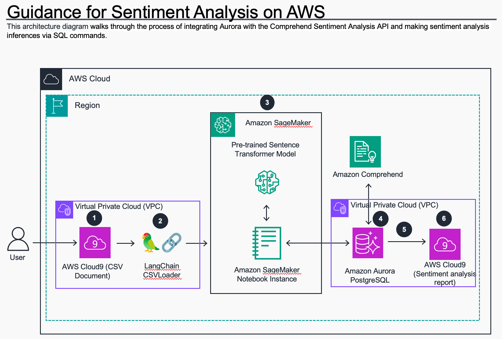
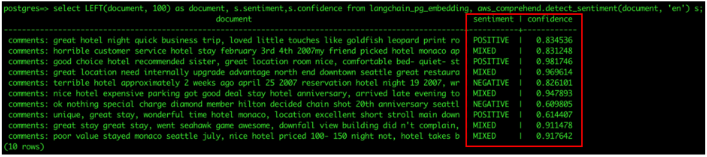

# Guidance for Sentiment Analysis on AWS

1. [Overview](#overview)
    - [Architecture](#architecture)
    - [Cost](#cost)
2. [Prerequisites](#prerequisites)
    - [Operating System](#operating-system)
3. [Deployment Steps](#deployment-steps)
4. [Deployment Validation](#running-the-guidance)
5. [Running the Guidance](#running-the-guidance)
6. [Next Steps](#next-steps)
7. [Cleanup](#cleanup)
8. [Notices](#notices)
9. [Known Issues](#known-issues)
10. [Authors](#authors)

## Overview
Generative AI – a category of artificial intelligence algorithms that can generate new content based on existing data — has been hailed as the next frontier for various industries, from tech to financial services, e-commerce and healthcare. The driving force behind the capabilities of generative AI chatbots lies in their foundation models. These models consist of expansive neural networks meticulously trained on vast amounts of unstructured, unlabeled data spanning various formats, including text and audio. The versatility of foundation models enables their utilization across a wide range of tasks, showcasing their limitless potential. 

In this Guidance, we will show how to generate Sentiment Analysis using Amazon Aurora PostgreSQL-Compatible Edition with pgvector enabled as the vector store. In this use case, we will walk you through the process of integrating Amazon Aurora PostgreSQL-Compatible Edition with the Comprehend Sentiment Analysis API and making sentiment analysis inferences via SQL commands. Amazon Comprehend is a natural language processing (NLP) service that uses machine learning to find insights and relationships in text.

[Amazon Comprehend](https://aws.amazon.com/comprehend/) is a natural language processing (NLP) service that uses machine learning to find insights and relationships in text. No prior machine learning experience is required. This example will walk you through the process of integrating Amazon Aurora PostgreSQL-Compatible Edition with the Comprehend Sentiment Analysis API and making sentiment analysis inferences via SQL commands. For our example, we have used a sample dataset with data for Fictitious Hotel Reviews. We use [Hugging Face’s sentence-transformers/all-mpnet-base-v2](https://huggingface.co/sentence-transformers/all-mpnet-base-v2) model for generating document embeddings and store vector embeddings in our Aurora PostgreSQL DB cluster with pgvector.

> [!Note]
> This demo involves creating an IAM Role and an associated IAM Policy to allow Amazon Aurora to interface with Amazon Comprehend. For steps on how to do this, please read through the blog post: [Leverage pgvector and Amazon Aurora PostgreSQL for Natural Language Processing, Chatbots and Sentiment Analysis](https://aws.amazon.com/blogs/database/leverage-pgvector-and-amazon-aurora-postgresql-for-natural-language-processing-chatbots-and-sentiment-analysis/).

### Architecture



### Cost

_You are responsible for the cost of the AWS services used while running this Guidance. We recommend creating a [Budget](https://docs.aws.amazon.com/cost-management/latest/userguide/budgets-managing-costs.html) through [AWS Cost Explorer](https://aws.amazon.com/aws-cost-management/aws-cost-explorer/) to help manage costs. Prices are subject to change. For full details, refer to the pricing webpage for each AWS service used in this Guidance._

### Sample Cost Table

The following table provides a sample cost breakdown for deploying this Guidance with the default parameters in the US West (Oregon) Region.

| AWS service  | Price per 10M units [USD] | Price per 10-50M units [USD] | Price over 50M units [USD] |
| ----------------- | -------------------------------| --------------------------------- | ------------------------------- |
| Amazon Comprehend | $ 0.0001  | $ 0.00005| $0.000025 |

| AWS service  | Instance type | Standard Price per hour [USD] |
| ----------- | ------------ | ------------ |
| Amazon Sagemaker - Notebook Instances | ml.t2.large | $ 0.111 |

| AWS service  | Instance type | Standard Price per hour [USD] |
| ----------- | ------------ | ------------ |
| Amazon Aurora | db.r6g.2xlarge  | $1.038 |

## Prerequisites
- The [AWS CLI](https://docs.aws.amazon.com/cli/latest/userguide/getting-started-install.html) installed.
- The visual editor of your choice, for example [Visual Studio Code](https://code.visualstudio.com/).
- Download CloudFormation template to quickly deploy and test the solution. Follow the steps that are mentioned in this [link](https://docs.aws.amazon.com/AWSCloudFormation/latest/UserGuide/cfn-console-create-stack.html) to deploy the stack.

### Operating System
In this sample code deployment we are using Linux operating system for Cloud9 EC2 instance and Amazon Aurora Postgresql instance.

## Deployment Steps

#### Clone the GitHub repository:

    ```
    git clone https://github.com/aws-solutions-library-samples/guidance-for-sentiment-analysis-on-aws.git
    cd ./guidance-for-sentiment-analysis-on-aws
    ```
#### Deploy the AWS CloudFormation Stack
This guidance utilizes the `AdministratorAccess` role for deployment. For use in a production environment, refer to the [security best practices](https://docs.aws.amazon.com/IAM/latest/UserGuide/best-practices.html) in the AWS Identity and Access Management (IAM) documentation and modify the IAM roles, Amazon Aurora, and other services used as needed.

* Using the AWS Management Console

    * Sign in to the AWS CloudFormation console
    * Create Stack > Upload the `./source/templates/prereq-sentiment-analysis.yaml` file
    * Deploy the stack after entering `Sentiment-Analysis` in the stack name
        * The parameters can be changed, but we recommend the default values for a smooth deployment.
     
## Deployment Validation

Open the AWS CloudFormation console and verify the status of the template with the name starting with `Sentiment-Analysis`.

Deploying this stack automatically configures the following environments:

- **VPC, Subnet, Internet Gateway, Security Groups, Route Table:** A VPC with public and private subnets, an internet gateway for public access, and Secrutiy Groups & Route Table for access control.
- **Amazon Aurora PostgreSQL cluster:** An Amazon Aurora PostgreSQL cluster consisting of a provisioned writer instance, a provisioned reader instance
- **Amazon SageMaker Notebook Instance:** An Amazon SageMaker notebook instance is a machine learning (ML) compute instance running the Jupyter Notebook App.
- **AWS Cloud9 IDE** AWS Cloud9 is a cloud-based integrated development environment (IDE) that lets you write, run, and debug your code with just a browser.
- **AWS Secrets Manager , AWS Key Management Service:** AWS Secrets Manager helps you manage, retrieve database credentials and AWS Key Management Service to encrypt the database cluster.
- **AWS Identity and Access Management - IAM Roles** IAM Roles defined with a set of permissions, allowing them to perform actions on AWS resources deployed in this guidance.
- **You can see the detailed output in the AWS CloudFormation `Sentiment-Analysis` stack Resources.**

    ```
    aws cloudformation describe-stacks --stack-name Sentiment-Analysis --query 'Stacks[0].Outputs' --output table --no-cli-pager
    ```

## Running the Guidance
#### Setup the environment in AWS Cloud9 to connect to Aurora PostgreSQL DB Cluster

- Navigate to the [AWS Cloud9 Console](https://console.aws.amazon.com/cloud9/home). Click on **New -> Terminal**
- Use the code block below to setup the environment (use the Copy button on the right to copy code)

    ```bash
    # Install JQuery for parsing output
    sudo yum install -y jq
    
    # Setup your environment variables to connect to Aurora PostgreSQL
    AWSREGION=`aws configure get region`
    
    PGHOST=`aws rds describe-db-cluster-endpoints \
        --db-cluster-identifier apgpg-pgvector \
        --region $AWSREGION \
        --query 'DBClusterEndpoints[0].Endpoint' \
        --output text`
    
    # Retrieve credentials from Secrets Manager - Secret: apgpg-pgvector-secret
    CREDS=`aws secretsmanager get-secret-value \
        --secret-id apgpg-pgvector-secret-$AWSREGION \
        --region $AWSREGION | jq -r '.SecretString'`
    
    export PGUSER="`echo $CREDS | jq -r '.username'`"
    export PGPASSWORD="`echo $CREDS | jq -r '.password'`"    
    export PGHOST
    
    # Install PostgreSQL 14 client and related utilities
    sudo amazon-linux-extras install -y postgresql14
    
    # Create pgvector extension
    psql -c "CREATE EXTENSION IF NOT EXISTS vector;"
    psql -c "CREATE EXTENSION IF NOT EXISTS aws_ml CASCADE;"
    ```
#### Semantic Search using Hugging Face

- This guide will walk through each step to understand and run the code in the Jupter Notebook. By following these instrcutions you should be able execute the code and observe the output.

> [!Note]
> In this lab, you will use a [Jupyter notebook](https://docs.aws.amazon.com/dlami/latest/devguide/setup-jupyter.html) , an open-source web application that you can use to create and share documents      that contain live code, equations, visualizations, and narrative text.

1. Navigate to the SageMaker console and search for [Jupyter notebook instance](https://console.aws.amazon.com/sagemaker/home#notebook-instances)  and select Open Jupyter.

[!Notebook](source/02_SimilaritySearchSentimentAnalysis/static/Launch_Jupyter_Notebook_Semantic.png)

2. Click to the `guidance-for-sentiment-analysis-on-aws/source/02_SimilaritySearchSentimentAnalysis` directory.

[!Folder-Structure](source/02_SimilaritySearchSentimentAnalysis/static/Folder-Structure.jpg)

3. Open a new **Terminal** in Jupyter to set environment variables that you will used for the labs as shown in the screenshot below. Click on **New -> Terminal**.

[!Terminal](source/02_SimilaritySearchSentimentAnalysis/static/Open-terminal.jpg)

   
4. If you don't have one, create a new access token on HuggingFace's website - [HuggingFace] (https://huggingface.co/settings/tokens) . Enter it when prompted by the code block below.

   [!Hugging-Face](source/02_SimilaritySearchSentimentAnalysis/static/Hugging_face_token.jpg) 

   ``` 
   read -p "Enter your HuggingFace token: " TOKEN
   ```

5. Use the code block below to create an .env file for your project in the same terminal.(use the Copy button on the right to copy code)

    ```
    # Install JQuery for parsing output
    sudo yum install -y jq
    
    # Setup your environment variables to connect to Aurora PostgreSQL
    AWSREGION=`aws configure get region`
    
    PGHOST=`aws rds describe-db-cluster-endpoints \
        --db-cluster-identifier apgpg-pgvector \
        --region $AWSREGION \
        --query 'DBClusterEndpoints[0].Endpoint' \
        --output text`
    
    # Retrieve credentials from Secrets Manager - Secret: apgpg-pgvector-secret
    CREDS=`aws secretsmanager get-secret-value \
        --secret-id apgpg-pgvector-secret-$AWSREGION \
        --region $AWSREGION | jq -r '.SecretString'`
    
    export PGUSER="`echo $CREDS | jq -r '.username'`"
    export PGPASSWORD="`echo $CREDS | jq -r '.password'`"    
    export PGHOST
    
    cd ~/SageMaker/guidance-for-sentiment-analysis-on-aws/source/02_SimilaritySearchSentimentAnalysis
    
    cat > .env << EOF
    HUGGINGFACEHUB_API_TOKEN='$TOKEN'
    PGVECTOR_DRIVER='psycopg2'
    PGVECTOR_USER='$PGUSER'
    PGVECTOR_PASSWORD='$PGPASSWORD'
    PGVECTOR_HOST='$PGHOST'
    PGVECTOR_PORT=5432
    PGVECTOR_DATABASE='postgres'
    EOF
    
    cat .env
    ```

    Your .env file should like the following:

    ```
    HUGGINGFACEHUB_API_TOKEN=<access_token>
    PGVECTOR_DRIVER='psycopg2'
    PGVECTOR_USER=<username>
    PGVECTOR_PASSWORD=<password>
    PGVECTOR_HOST=<Aurora DB endpoint>
    PGVECTOR_PORT=5432
    PGVECTOR_DATABASE=<dbname>
    ```

Once the environment variables are set , you can exit the terminal
   
6. Open the notebook `pgvector_with_langchain_auroraml.ipynb.`

[!Hugging-Face](source/02_SimilaritySearchSentimentAnalysis/static/Hugging_face_token.jpg) 

7. In the Menu Bar, select Kernel -> Change kernel and select conda_tensorflow2_p310.

8. Clear the current output in all the cells using the menu and selecting: Cell -> All Output -> Clear.

9. In this lab, we have created a requirements.txt file in the apgpgvector-langchain-auroraml folder that contains all the libraries and packages you will need to complete this lab. Begin by installing the necessary libraries. (~5 mins)

10. pgvector integration with LangChain needs the connection string to the database. In this step, you will connect to the database and generate the embeddings. Note that you will pass in the connection details as well as the HuggingFace API Token from your .env file. Your code block should look like the below:     

    ```
    from dotenv import load_dotenv
    from langchain.document_loaders import CSVLoader
    from langchain.text_splitter import CharacterTextSplitter
    from langchain.embeddings import HuggingFaceInstructEmbeddings
    from langchain.vectorstores.pgvector import PGVector, DistanceStrategy
    from langchain.docstore.document import Document
    import os
    
    load_dotenv()
    
    embeddings = HuggingFaceInstructEmbeddings(model_name="sentence-transformers/all-mpnet-base-v2")
    
    connection_string = PGVector.connection_string_from_db_params(                                                  
        driver = os.environ.get("PGVECTOR_DRIVER"),
        user = os.environ.get("PGVECTOR_USER"),                                      
        password = os.environ.get("PGVECTOR_PASSWORD"),                                  
        host = os.environ.get("PGVECTOR_HOST"),                                            
        port = os.environ.get("PGVECTOR_PORT"),                                          
        database = os.environ.get("PGVECTOR_DATABASE")                                       
    )
    ```
    
    If the run is successful, you should see an output as follows:
    
    ```
    /../pgvector-with-langchain-auroraml/venv/lib/python3.9/site-packages/InstructorEmbedding/instructor.py:7: TqdmExperimentalWarning: Using `tqdm.autonotebook.tqdm` in notebook mode. Use `tqdm.tqdm` 
    instead to force console mode (e.g. in jupyter console)
      from tqdm.autonotebook import trange
    load INSTRUCTOR_Transformer
    load INSTRUCTOR_Transformer
    max_seq_length  512
    ```

11. Load a sample fictitious hotel dataset (CSV) with LangChain's CSVLoader .
    
    ```
    loader = CSVLoader('./data/test.csv', source_column="comments")
    documents = loader.load()
    ```

12. Split the text using LangChain’s [CharacterTextSplitter](https://js.langchain.com/docs/modules/indexes/text_splitters/examples/character) function and generate chunks:
    
    ```
    text_splitter = CharacterTextSplitter(chunk_size=1000, chunk_overlap=0)
    docs = text_splitter.split_documents(documents)
    print(len(documents))
    print(len(docs))
    
    # Access the content and metadata of each document
    for document in documents:
        content = print(document.page_content)
        metadata = print(document.metadata)
    ```

    If the run is successful, you should see an output as follows:
    
    ```
    10
    10
    <<Summarized output>>
    comments: great hotel night quick business trip, loved little touches like goldfish leopard print robe, complaint wifi complimentary not internet access business center, great location library     
    service fabulous,
    {'source': 'great hotel night quick business trip, loved little touches like goldfish leopard print robe, complaint wifi complimentary not internet access business center, great location library 
    service fabulous,  ', 'row': 0}
    comments: horrible customer service hotel stay february 3rd 4th 2007my friend picked hotel monaco appealing website online package included champagne late checkout 3 free valet gift spa weekend, 
    friend checked room hours earlier came later, pulled valet young man just stood, asked valet open said, pull bags didn__Ç_é_ offer help, got garment bag suitcase came car key room number says not 
    valet, car park car street pull, left key working asked valet park car gets, went room fine bottle champagne oil lotion gift spa, dressed went came got bed noticed blood drops pillows sheets 
    pillows, disgusted just unbelievable, called desk sent somebody 20 minutes later, swapped sheets left apologizing, sunday morning called desk speak management sheets aggravated rude, apparently no 
    manager kind supervisor weekend wait monday morning
    {'source': 'horrible customer service hotel stay february 3rd 4th 2007my friend picked hotel monaco appealing website online package included champagne late checkout 3 free valet gift spa weekend, 
    friend checked room hours earlier came later, pulled valet young man just stood, asked valet open said, pull bags didn__Ç_é_ offer help, got garment bag suitcase came car key room number says not 
    valet, car park car street pull, left key working asked valet park car gets, went room fine bottle champagne oil lotion gift spa, dressed went came got bed noticed blood drops pillows sheets 
    pillows, disgusted just unbelievable, called desk sent somebody 20 minutes later, swapped sheets left apologizing, sunday morning called desk speak management sheets aggravated rude, apparently no 
    manager kind supervisor weekend wait monday morning', 'row': 1}
    .
    .
    .
    ```

13. The PGVector module will try to create a table with the name of the collection. So, make sure that the collection name is unique and the user has the [permissions](https://www.postgresql.org/docs/current/ddl-priv.html) to create a table. This takes a few minutes to complete depending on the size of the dataset.
   
    ```
    from typing import List, Tuple
    
    collection_name = "fictitious_hotel_reviews"
    
    db = PGVector.from_documents(
         embedding=embeddings,
         documents=docs,
         collection_name=collection_name,
         connection_string=connection_string
    )
    ```

14. Run a similarity search using the [similarity_search_with_score](https://python.langchain.com/docs/modules/data_connection/vectorstores/integrations/pgvector) function from pgvector.

    ```
    query = "What do some of the positive reviews say?"
    docs_with_score: List[Tuple[Document, float]] = db.similarity_search_with_score(query)
    ```
    ```
    for doc, score in docs_with_score:
        print("-" * 80)
        print("Score: ", score)
        print(doc.page_content)
        print(doc.metadata)
        print("-" * 80)
    ```

    If the run is successful, you should see an output as follows:

    ```
    Score:  0.9238530395691034
    comments: nice hotel expensive parking got good deal stay hotel anniversary, arrived late evening took advice previous reviews did valet parking, check quick easy, little disappointed non-existent view room room clean nice size, bed comfortable woke stiff neck high pillows, not soundproof like heard music room night morning loud bangs doors opening closing hear people talking hallway, maybe just noisy neighbors, aveda bath products nice, did not goldfish stay nice touch taken advantage staying longer, location great walking distance shopping, overall nice experience having pay 40 parking night,
    {'source': 'nice hotel expensive parking got good deal stay hotel anniversary, arrived late evening took advice previous reviews did valet parking, check quick easy, little disappointed non-existent view room room clean nice size, bed comfortable woke stiff neck high pillows, not soundproof like heard music room night morning loud bangs doors opening closing hear people talking hallway, maybe just noisy neighbors, aveda bath products nice, did not goldfish stay nice touch taken advantage staying longer, location great walking distance shopping, overall nice experience having pay 40 parking night,  ', 'row': 5}
    
    Score:  0.975017819981635
    comments: great location need internally upgrade advantage north end downtown seattle great restaurants nearby good prices, rooms need updated literally thought sleeping 1970 bed old pillows sheets, net result bad nights sleep, stay location, staff friendly,
    {'source': 'great location need internally upgrade advantage north end downtown seattle great restaurants nearby good prices, rooms need updated literally thought sleeping 1970 bed old pillows sheets, net result bad nights sleep, stay location, staff friendly,  ', 'row': 3}
    
    Score:  1.0084132474978011
    comments: great hotel night quick business trip, loved little touches like goldfish leopard print robe, complaint wifi complimentary not internet access business center, great location library service fabulous,
    {'source': 'great hotel night quick business trip, loved little touches like goldfish leopard print robe, complaint wifi complimentary not internet access business center, great location library service fabulous,  ', 'row': 0}
    
    Score:  1.0180131593936907
    comments: good choice hotel recommended sister, great location room nice, comfortable bed- quiet- staff helpful recommendations restaurants, pike market 4 block walk stay
    {'source': 'good choice hotel recommended sister, great location room nice, comfortable bed- quiet- staff helpful recommendations restaurants, pike market 4 block walk stay', 'row': 2}
    ```

15. Use the Cosine function to refine the results to the best possible match

    ```
        store = PGVector(
            connection_string=connection_string, 
            embedding_function=embeddings, 
            collection_name='fictitious_hotel_reviews',
            distance_strategy=DistanceStrategy.COSINE
        )
    
        retriever = store.as_retriever(search_kwargs={"k": 1})
    
        retriever.get_relevant_documents(query='What do some of the positive reviews say?')
    ```

    If the run is successful, you should see an output as follows:

    ```
    Document(page_content='comments: nice hotel expensive parking got good deal stay hotel anniversary, arrived late evening took advice previous reviews did valet parking, check quick easy, little     
    disappointed non-existent view room room clean nice size, bed comfortable woke stiff neck high pillows, not soundproof like heard music room night morning loud bangs doors opening closing hear 
    people talking hallway, maybe just noisy neighbors, aveda bath products nice, did not goldfish stay nice touch taken advantage staying longer, location great walking distance shopping, overall nice 
    experience having pay 40 parking night,', metadata={'source': 'nice hotel expensive parking got good deal stay hotel anniversary, arrived late evening took advice previous reviews did valet 
    parking, check quick easy, little disappointed non-existent view room room clean nice size, bed comfortable woke stiff neck high pillows, not soundproof like heard music room night morning loud 
    bangs doors opening closing hear people talking hallway, maybe just noisy neighbors, aveda bath products nice, did not goldfish stay nice touch taken advantage staying longer, location great 
    walking distance shopping, overall nice experience having pay 40 parking night,  ', 'row': 5})
    ```

Similarly, you can test results with other distance strategies such as Euclidean or Max Inner Product. Euclidean distance depends on a vector’s magnitude whereas cosine similarity depends on the angle between the vectors. The angle measure is more resilient to variations of occurrence counts between terms that are semantically similar, whereas the magnitude of vectors is influenced by occurrence counts and heterogeneity of word neighborhood. Hence for similarity searches or semantic similarity in text, the cosine distance gives a more accurate measure.

16. Run Comprehend inferences from Aurora

Aurora has a built-in Comprehend function which can call the Comprehend service. It passes the inputs of the aws_comprehend.detect_sentiment function, in this case the values of the document column in the langchain_pg_embedding table, to the Comprehend service and retrieves sentiment analysis results (note that the document column is trimmed due to the long free form nature of reviews):

Login in to [AWS Cloud9 IDE](https://console.aws.amazon.com/cloud9/home) and the run the below SQL query using psql.

    ```
    select LEFT(document, 100) as document, s.sentiment, s.confidence from langchain_pg_embedding, aws_comprehend.detect_sentiment(document, 'en') s;
    ```

You should see results as shown in the screenshot below. Observe the columns sentiment, and confidence. The combination of these two columns provide the inferred sentiment for the text in the document column, and also the confidence score of the inference.



## Next Steps

In this Guidance ,we have used a sample dataset for fictitious hotel reviews. We use Hugging Face’s sentence-transformers/all-mpnet-base-v2 model for generating document embeddings and store vector embeddings in our Aurora PostgreSQL DB cluster with pgvector. Refer to these additional blog posts for more details.

[Leverage pgvector and Amazon Aurora PostgreSQL for Natural Language Processing, Chatbots and Sentiment Analysis](https://aws.amazon.com/blogs/database/leverage-pgvector-and-amazon-aurora-postgresql-for-natural-language-processing-chatbots-and-sentiment-analysis/)

## Cleanup

This Guidance requires manual deletion of resources created as part of this guidance. If AWS Cloud9 instance and Amazon Aurora DB Cluster were newly created following the steps per this guidance, then those have to be manually deleted when no longer required. 

## Notices

*Customers are responsible for making their own independent assessment of the information in this Guidance. This Guidance: (a) is for informational purposes only, (b) represents AWS current product offerings and practices, which are subject to change without notice, and (c) does not create any commitments or assurances from AWS and its affiliates, suppliers or licensors. AWS products or services are provided “as is” without warranties, representations, or conditions of any kind, whether express or implied. AWS responsibilities and liabilities to its customers are controlled by AWS agreements, and this Guidance is not part of, nor does it modify, any agreement between AWS and its customers.*

### License

The GenAI Q&A Chatbot with pgvector and Amazon Aurora PostgreSQL-compatible edition application is released under the [MIT-0 License](https://spdx.org/licenses/MIT-0.html).

## Known Issues
#### I am encountering an error about token dimension mismatch (1536 vs 768)

Follow the recommendations from this [GitHub Issue thread](https://github.com/hwchase17/langchain/issues/2219).

## Authors
- Shayon Sanyal
- Krishna Sarabu
- Raj Jayakrishnan
- Sharath Chandra Kampili
- Yamuna Palasamudram

### Contribution
This repository is intended for educational purposes and does not accept further contributions. Feel free to utilize and enhance the app based on your own requirements.

